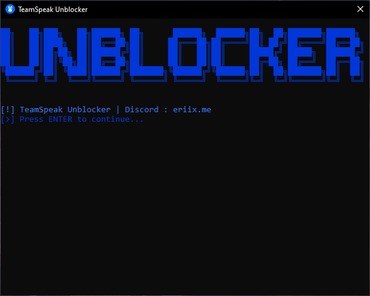

# **TeamSpeak Unblocker** 🛡️  

🔹 **A Python script & executable to bypass TeamSpeak's blacklist by modifying the hosts file.**  

---

## **📌 Description**  
This tool blocks TeamSpeak's blacklist servers (`blacklist.teamspeak.com` and `blacklist2.teamspeak.com`) by redirecting them to `127.0.0.1` in the `hosts` file.  

### **✨ Features**  
- ✅ **Easy-to-use** – Run `Unblocker.exe` (Windows) or `Unblocker.py` (Python).  
- 🔄 **Automatic Backup** – Creates a backup of your original `hosts` file.  
- 🛡️ **Admin Check** – Ensures script runs with elevated privileges.  
- 🎨 **User-Friendly UI** – Colorful console output with loading animations.  

---

## **🚀 Getting Started**  

### **📥 Prerequisites**  
- **Windows OS** (For `.exe` version).  
- **Python 3.x** (For `.py` version) – [Download Python](https://www.python.org/downloads/).  

### **⚙️ Installation**  
1. **Download the files:**  
   - `Unblocker.exe` (Pre-built executable).  
   - `Unblocker.py` (Python script).  
   - `icon.ico` (Application icon).  

2. **Run as Administrator:**  
   - Right-click `Unblocker.exe` or `Unblocker.py` > **Run as Administrator**.  

3. **Follow on-screen instructions.**  

---

## **📸 Screenshots**  
  

---

## **📜 License**  
**Apache License 2.0** – See [LICENSE](LICENSE) for details.  

---

## **📬 Contact & Support**  
- **Discord:** `eriix.me`  
- **GitHub:** [DoctorERIIX](https://github.com/DoctorERIIX)  

---

## **💡 Notes**  
- 🔄 **Manual Backup:** Always back up your `hosts` file before running.  
- ⚠️ **Disclaimer:** Use responsibly. Not affiliated with TeamSpeak.  
